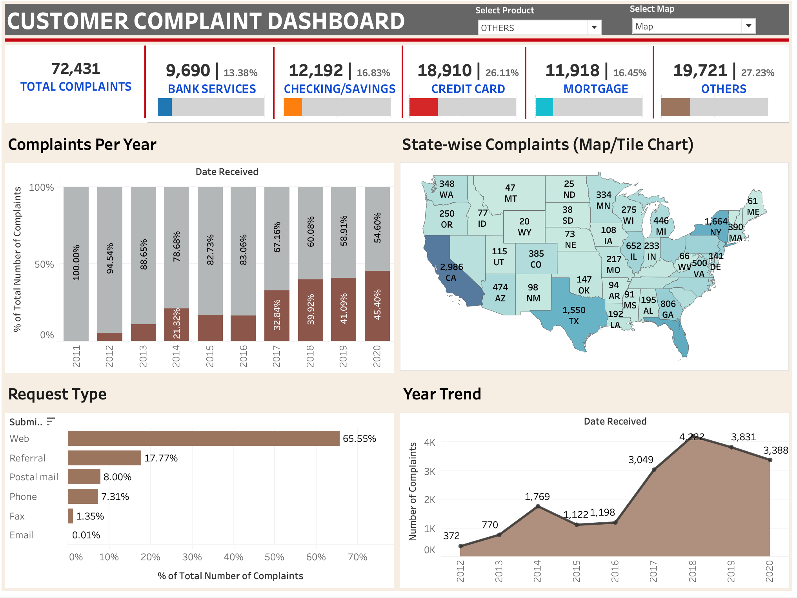

# Customer Complaint Dashboard

## Overview

This project is a data visualization dashboard that showcases customer complaints categorized by product types, request methods, year trends, and state-wise distribution. The purpose of this dashboard is to provide insights into the distribution and trends of customer complaints across various categories and geographical regions.

 

---

## Features

- **Total Complaints Overview**: Summarizes the total number of complaints along with breakdowns by product types like Bank Services, Checking/Savings, Credit Card, Mortgage, and Others.
- **Complaints Per Year**: Displays the yearly trend in complaints with a percentage breakdown.
- **State-wise Complaints Map**: A geographic heat map showing the number of complaints for each state.
- **Request Type Distribution**: Visualizes the different mediums used for submitting complaints (Web, Referral, Postal Mail, etc.).
- **Year Trend**: Highlights the yearly growth or decline in the number of complaints.

---

## Dataset

### 1. Complaints Dataset (`complaints_Full Data.csv`)
- Contains detailed records of customer complaints with columns such as:
  - Date Received
  - Product Type
  - State
  - Request Type
  - Complaint ID

### 2. State Map Dataset (`State Map_Full Data.csv`)
- Contains state-level data for mapping purposes with columns:
  - State Abbreviation
  - Total Complaints
  - Other state-specific details as needed.

---

## Data Preparation and Joins

The two datasets were joined on the `State` column to merge the complaint data with state-wise geographical information. This ensured accurate mapping and visualization of complaints by state.

Steps involved:
1. Cleaned and pre-processed the data to handle missing or inconsistent values.
2. Used an inner join operation on the `State` field to combine `complaints_Full Data` and `State Map_Full Data`.

---

## Tools and Technologies

- **Python**: Data cleaning and processing (using Pandas and NumPy libraries).
- **Tableau**: Used for creating the dashboard and visualizations.
- **Excel**: Pre-processing and exploratory data analysis.
- **Git**: Version control.

---

## Installation and Usage

1. **Clone the Repository**:
   ```bash
   git clone https://github.com/your-username/customer-complaint-dashboard.git
   cd customer-complaint-dashboard
